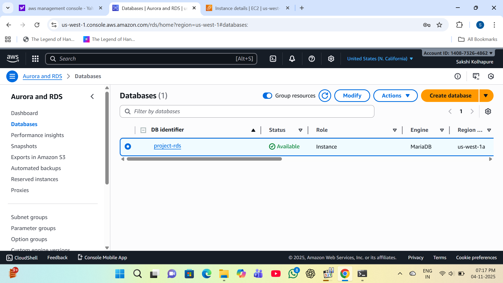
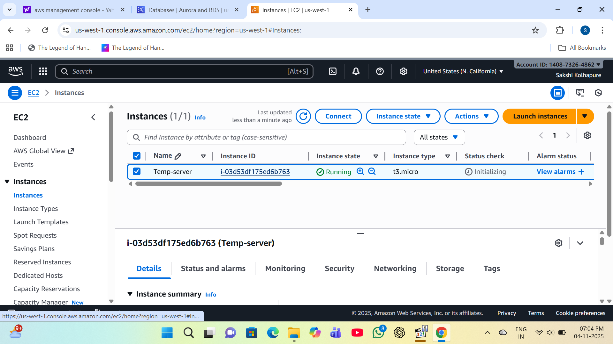
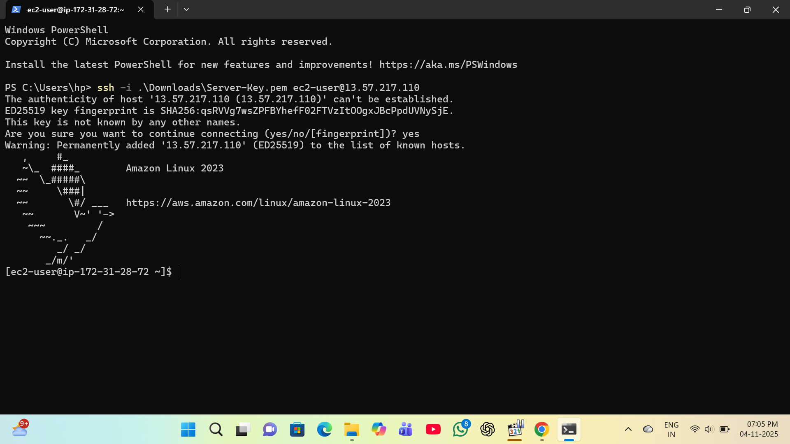
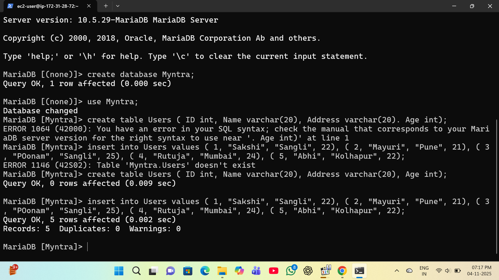
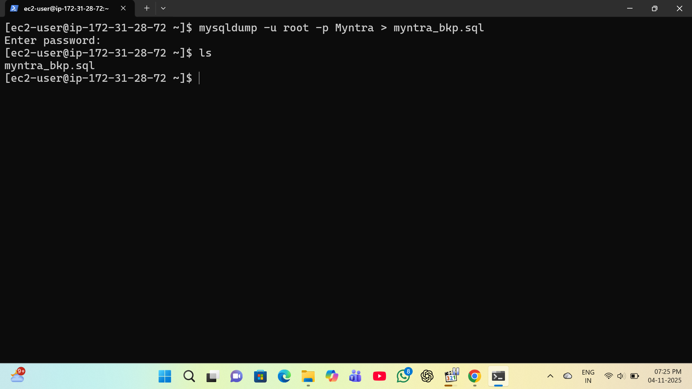
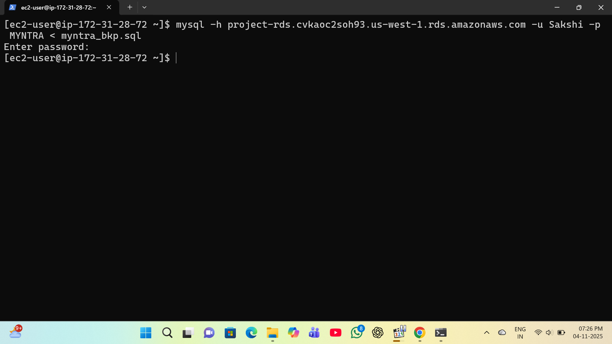
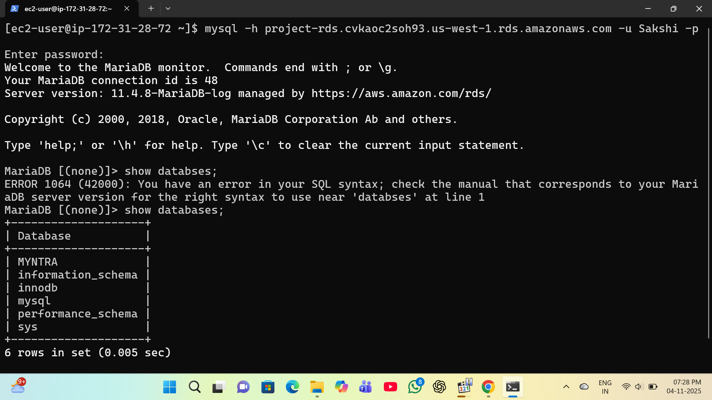

# Data Migration using Amazon RDS (Iaas -> Paas)

## Project Overview 

In this mini project, we are moving a **datbase** from an **EC2 Instance (Iaas)** to **Amazon RDS (Paas)**. 

This shows how data can be easily shifted from a self-managed databse to a managed database service.

---
## Aim of project:

- To undestand the difference between Iaas and Paas 
- To learn how to miagrate data from Ec2 MySQL to RDS MySQL
- To see how RDS makes database management easier.
---
## Simple architecture
EC2 Instance (MySQL) 
 ----> Amazon RDS (MySQL)

              Iaas ----> Paas   

---

## Steps to do the Project

### Step1:Create Amazon RDS (Paas)

1. Go to AWS Console --> RDS --> Allow 3306 port number to security group --> Create dabase named as MYNTRA.

### Step2: Create Database on Ec2 (Iaas)

1. Launch an temperory EC2 instance-

2. Take access of your EC2 instance-

3. Install and start mariadb105-server-

4. Go to mysql-

 5. create dabase named as Myntra and create table and insert values into table-

### Step 3: Extract data from EC2 server and convert into file-

### Step 4: Migrate data from Ec2 to RDS

### Step 5: Go to your RDS instance

### Step 6: Check data from MYNTRA datbase

----
## Conclusion

By using Amazon RDS, we don’t need to handle database maintenance manually.
It saves time, gives backups automatically, and is easier to scale when needed.
